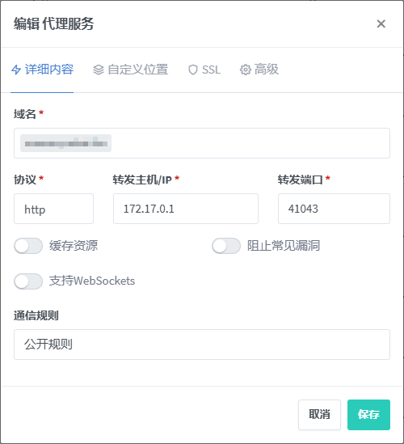
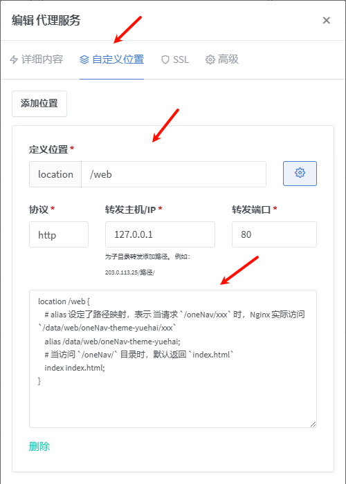
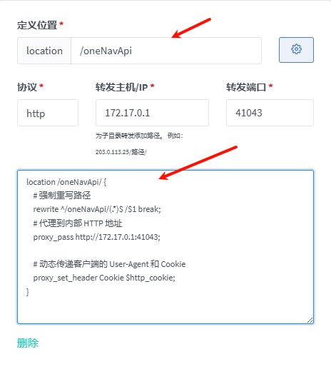
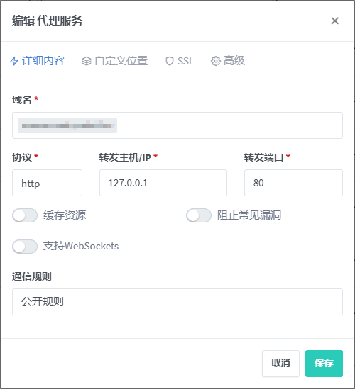
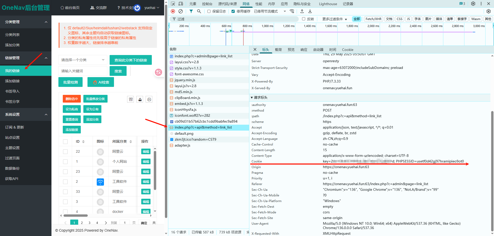
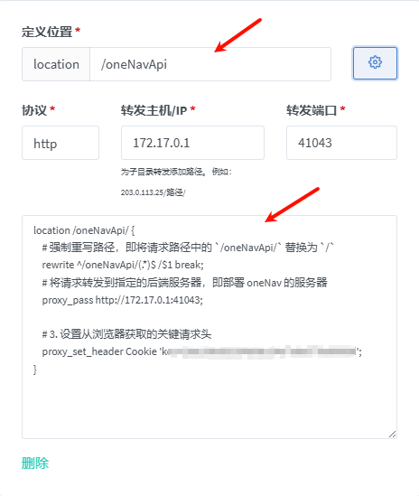

# 一、月海的 oneNav 主题

## 1、说明

1. 基于 Vue3 + Vite 开发的 oneNav 主题
2. 开发原因是便于我自己自定义样式和功能，以及学习 Vue3 和 Vite
3. 需要手动部署，不能像 oneNav 的主题一样直接上传到服务器

## 2、主题

### ①、tushan

1. tushan 主题样式仿照：https://github.com/tsxcw/oneNav
2. 改动：
   1. 分类左侧目录列表，点击可使右侧链接列表滚动到指定位置
   2. 链接图标先获取 oneNav 中配置的，如果没有配置，再自动获取
   3. 链接图标自动获取可能失败，此时建议手动在 oneNav 中配置


### ②、

# 二、配置修改

## 1、服务器配置文件 server_config.json

1. 位置：/public/server_config.json
2. 配置项：
3. `apiBaseUrl`：oneNav 后端接口地址，如：http://89.164.23.214:8080
4. `token`：oneNav 后端接口的 token，用于请求接口时的身份验证


## 2、

# 三、开发命令

1. 安装依赖

```shell
npm install
```

2. 启动项目

```shell
npm run dev
```

3. 打包项目

```shell
npm run build
```

# 四、依赖：

1. 常用依赖
   1. less 是一种动态样式语言，可以方便地为网页增加复杂的样式
   2. vue-router 是 Vue.js 官方的路由管理器，适用于 Vue.js 应用程序的路由
   3. pinia 是一个用于 Vue 3 的状态管理库，它使用 Vue 3 的响应式系统来管理状态
   4. pinia-plugin-persist 是一个用于 pinia 的插件，用于在浏览器中持久化 pinia 的状态，以便在刷新页面后恢复状态；其本质是将状态存储在 localStorage 中
   5. axios 是一个基于 promise 的 HTTP 库，可以用在浏览器和 node.js 中

```shell
npm install less-loader vue-router@4 pinia pinia-plugin-persist axios
```

# 五、nginx 配置

## 1、nginx-proxy-manager 部署

1. 我个人使用的是 docker 部署的 nginx-proxy-manager，所以配置文件是在 webui 中配置的
2. 为防止容器意外停止后数据丢失，首先在宿主机创建目录：
   1. 文件目录：`/home/docker/docker/volumes/nginx-proxy-manager/data`
   2. 原镜像是：`jc21/nginx-proxy-manager`，此处使用的是汉化版
3. 使用 docker 部署：
   1. `-d`：后台运行容器并返回容器 ID，也即启动守护式容器(后台运行)
   2. `-p`：指定端口映射
      1. `81`：nginx-proxy-manager 的 web 访问端口
      2. `80`：http 代理端口，访问代理的 http 地址时，需要加上这个端口
      3. `443`：https 代理端口，访问代理的 https 地址时，需要加上这个端口
   3. `-v`：指定挂载目录
   4. `--restart=unless-stopped`：指定容器的重启策略。除非显式停止，否则总是在宿主机重启或容器退出时重启容器。

```shell
docker run -d \
-p 81:81 \
-p 80:80 \
-p 443:443 \
-v /home/docker/docker/volumes/nginx-proxy-manager/data:/data \
-v /ssl/:/etc/letsencrypt \
--name=nginx-proxy-manager-zh \
chishin/nginx-proxy-manager-zh:latest
```

4. 部署成功后，访问：[http://127.0.0.1:81](http://127.0.0.1:81) 进入管理后台
5. 初始管理员账号：`admin@example.com`
6. 初始管理员密码：`changeme`

## 2、上传编译后的文件

1. 在挂载目录下，即 `/home/docker/docker/volumes/nginx-proxy-manager/data`，创建一个目录：`web`
2. 再在 `web` 目录下创建一个目录：`oneNav-theme-yuehai`
3. 将编译后的文件上传到 `oneNav-theme-yuehai` 目录下


# 六、代理设置

## 1、oneNav 后台的一些说明

1. 发开前端的过程中发现，oneNav 的接口都是基于相对路径的，所以前端页面的访问地址和后端接口的访问地址最好在同一域名下，这样可以通用 cookie
2. 如果前端页面和后端接口不在同一域名下，则需要在前端页面的代理中配置后端接口的 cookie，否则会验证失败
3. 下面是两种情况的配置方法，最后还有通用的配置

## 2、和 onenav 后台在同一子域名下

### <span id="6-2">①、基础代理设置</span>

1. 因为是和 onenav 后台在同一子域名下，所以只需要配置 oneNav 后台的代理即可
2. 这里假设 oneNav 后台是部署在 docker 容器中
   1. docker 网络模式是 bridge 模式，即 ip 是：172.17.0.1
   2. oneNav 后台映射出来的的端口是 41043 
3. 配置详情如下，配置后访问：`https://域名:端口/` 即可访问 onenav 默认前端主题页面



### <span id="6-3">②、添加自定义位置：`/web`</span>

> 该位置用于访问该项目的前端页面

1. 点击自定义位置：
   1. 定义位置：`/web`
   2. 协议：http
   3. 转发主机/IP：`127.0.0.1`
   4. 转发端口：`80`
2. 然后点击定义位置后的齿轮按钮，在输入框中输入以下内容
3. 配置后访问：`https://域名:端口/web` 即可访问该项目的前端页面

```nginx
location /web {
    # alias 设定了路径映射，表示 当请求 `/oneNav/xxx` 时，Nginx 实际访问 `/data/web/oneNav-theme-yuehai/xxx`
    alias /data/web/oneNav-theme-yuehai;
    # 当访问 `/web/` 目录时，默认返回 `index.html`
    index index.html;
}
```



### ③、添加自定义位置：`/oneNavApi`

> 该位置用于访问 oneNav 主题的后端接口，获取导航书签数据

1. 点击添加位置，设置第二个自定义位置：
   1. 定义位置：`/oneNavApi`
   2. 协议：http
   3. 转发主机/IP：部署 oneNav 的服务器 ip，即上面的 `172.17.0.1`
   4. 转发端口：部署 oneNav 的服务器端口，即上面的 `41043`
2. 然后点击定义位置后的齿轮按钮，在输入框中输入以下内容：

```nginx
location /oneNavApi/ {
    # 强制重写路径，即将请求路径中的 `/oneNavApi/` 替换为 `/`
    rewrite ^/oneNavApi/(.*)$ /$1 break; 
    # 将请求转发到指定的后端服务器，即部署 oneNav 的服务器
    proxy_pass http://172.17.0.1:41043; 

    # 动态传递客户端的 Cookie，用于 oneNav 后端的身份验证
    proxy_set_header Cookie $http_cookie; 
}
```



## 3、和 onenav 后台不在同一子域名下

### ①、基础代理设置

1. 因为是和 onenav 后台不在同一子域名下，所以需要配置 onenav 后台的代理、前端页面的代理
2. onenav 后台的代理和上面 [和 onenav 后台在同一子域名下的基础代理设置](#6-2) 的配置一样
3. 前端页面的代理配置如下，其中的 协议、转发主机/IP、转发端口 都是占位，没有实际作用



### ②、添加自定义位置：`/web`

1. 此处添加自定义位置和上面 [和 onenav 后台在同一子域名下的添加自定义位置：`/web`](#6-3) 的配置一样
2. 配置后访问：`https://域名:端口/web` 即可访问该项目的前端页面

### ③、添加自定义位置：`/oneNavApi`

1. 此处添加自定义位置和上面不同，首先需要进入部署的 oneNav 后台
2. 登录后，按 f12 打开开发者工具，然后点击我的连接，在开发者工具的 Network 面板中，找到 `/index.php` 请求，复制其中的 cookie 值



3. 回到 nginx，点击添加位置，设置第二个自定义位置：
   1. 定义位置：`/oneNavApi`
   2. 协议：http
   3. 转发主机/IP：部署 oneNav 的服务器 ip，即上面的 `172.17.0.1`
   4. 转发端口：部署 oneNav 的服务器端口，即上面的 `41043`
4. 然后点击定义位置后的齿轮按钮，在输入框中输入以下内容，将最后一行的 `key=***` 替换为上面复制的 cookie 值

```nginx
location /oneNavApi/ {
    # 强制重写路径，即将请求路径中的 `/oneNavApi/` 替换为 `/`
    rewrite ^/oneNavApi/(.*)$ /$1 break; 
    # 将请求转发到指定的后端服务器，即部署 oneNav 的服务器
    proxy_pass http://172.17.0.1:41043; 

    # 动态传递客户端的 Cookie，用于 oneNav 后端的身份验证
    proxy_set_header Cookie 'key=***';
}
```



## 4、通用配置

### ①、添加自定义位置：`/linkIcon`

> 1. 该位置用于访问获取网站图标的 api 接口；因为上面的 faviconkit 不能用了，所以自己写了一个
> 2. 对应的 java 后端程序：[yuehai-tool-1.0-SNAPSHOT-jar-with-dependencies.jar](doc/project/yuehai-tool-1.0-SNAPSHOT-jar-with-dependencies.jar)
> 3. 对应的 java 后端接口：http://127.0.0.1:10300/query/website_icon?url=https://www.baidu.com/

1. 点击添加位置，设置第三个自定义位置（参数修改为后端部署的地址）：
   1. 定义位置：`/linkIcon`
   2. 协议：http
   3. 转发主机/IP：`127.0.0.1`
   4. 转发端口：`10300`
2. 然后点击定义位置后的齿轮按钮，在输入框中输入以下内容：
   1. `proxy_pass https://127.0.0.1:10300/;`：将请求转发到指定的后端服务器，即 https://127.0.0.1:10300/

```nginx
location /linkIcon/ {
    # 将请求转发到指定的后端服务器，即获取网站图标的 java 服务器
    proxy_pass http://172.17.0.1:41900/;
    # 设置转发请求头中的 X-Real-IP 字段，值为发起请求的客户端的真实 IP 地址
    proxy_set_header X-Real-IP $remote_addr;
    # 设置转发请求头中的 X-Forwarded-For 字段，用于追踪经过多层代理的请求源 IP
    proxy_set_header X-Forwarded-For $proxy_add_x_forwarded_for;
    # 设置转发请求头中的 X-Forwarded-Proto 字段，值为原始请求使用的协议（http 或 https）
    proxy_set_header X-Forwarded-Proto $scheme;
    # 关闭 Nginx 自动修改后端服务器响应头中的 Location 和 Refresh 字段
    # 通常在后端能正确处理重定向时设为 off，以避免不必要的修改
    proxy_redirect off;
    
    # 如果代理为了 https 协议，则需要以下配置
    # 设置转发到后端服务器的请求头中的 Host 字段
    # proxy_set_header Host www.test.com;
    # 启用 SNI（服务器名称指示）功能，在与后端服务器建立 SSL/TLS 连接时
    # 允许 Nginx 发送主机名，以便后端服务器能根据不同域名返回正确的 SSL 证书
    # proxy_ssl_server_name on;
    # 指定在与后端服务器进行 SSL/TLS 握手时使用的 SNI 名称，明确告诉后端，Nginx 是代表 www.test.com 这个域名来请求的
    # proxy_ssl_name www.test.com;
}
```


## 5、配置结束

1. 设置完毕后，点击保存即可
2. 最后访问：`https://域名:端口/web`  即可访问该项目的前端页面


