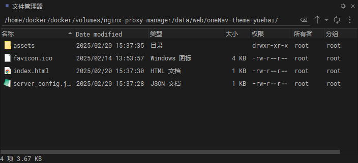
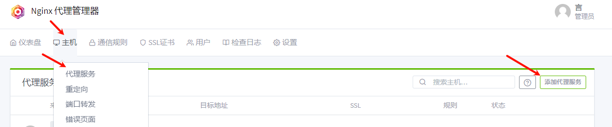
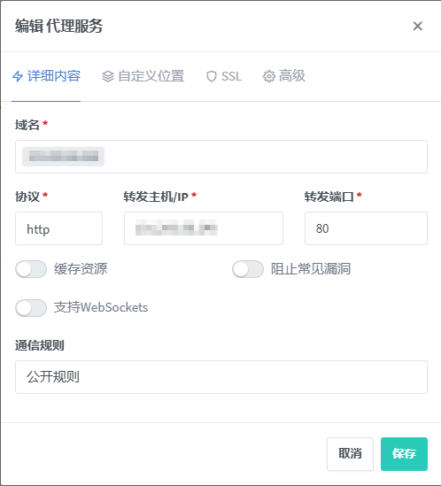
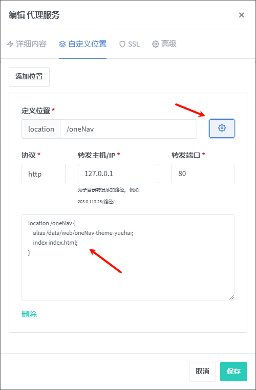
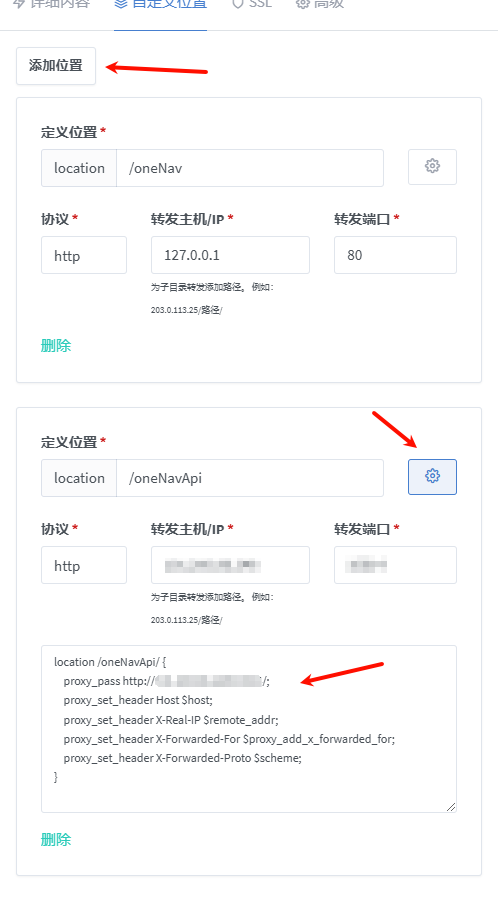

# 一、月海的 oneNav 主题

## 1、说明

1. 基于 Vue3 + Vite 开发的 oneNav 主题
2. 开发原因是便于我自己自定义样式和功能，以及学习 Vue3 和 Vite
3. 需要手动部署，不能像 oneNav 的主题一样直接上传到服务器

## 2、主题

1. tushan 主题样式仿照：https://github.com/tsxcw/oneNav

# 二、命令

1. 安装依赖

```shell
npm install
```

2. 启动项目

```shell
npm run dev
```

3. 打包项目

```shell
npm run build
```

# 三、依赖：

1. 常用依赖
   1. less 是一种动态样式语言，可以方便地为网页增加复杂的样式
   2. vue-router 是 Vue.js 官方的路由管理器，适用于 Vue.js 应用程序的路由
   3. pinia 是一个用于 Vue 3 的状态管理库，它使用 Vue 3 的响应式系统来管理状态
   4. pinia-plugin-persist 是一个用于 pinia 的插件，用于在浏览器中持久化 pinia 的状态，以便在刷新页面后恢复状态；其本质是将状态存储在 localStorage 中
   5. axios 是一个基于 promise 的 HTTP 库，可以用在浏览器和 node.js 中

```shell
npm install less-loader vue-router@4 pinia pinia-plugin-persist axios
```

# 四、nginx 配置

## 1、nginx-proxy-manager 部署

1. 我个人使用的是 docker 部署的 nginx-proxy-manager，所以配置文件是在 webui 中配置的
2. 为防止容器意外停止后数据丢失，首先在宿主机创建目录：
   1. 文件目录：`/home/docker/docker/volumes/nginx-proxy-manager/data`
   2. 原镜像是：`jc21/nginx-proxy-manager`，此处使用的是汉化版
3. 使用 docker 部署：
   1. `-d`：后台运行容器并返回容器 ID，也即启动守护式容器(后台运行)
   2. `-p`：指定端口映射；因为家庭宽带的 80、443 端口一般都是被封的，所以这里一般修改为其他端口
      1. `81`：nginx-proxy-manager 的 web 访问端口
      2. `80`：http 代理端口，访问代理的 http 地址时，需要加上这个端口
      3. `443`：https 代理端口，访问代理的 https 地址时，需要加上这个端口
   3. `-v`：指定挂载目录
   4. `--restart=unless-stopped`：指定容器的重启策略。除非显式停止，否则总是在宿主机重启或容器退出时重启容器。

```shell
docker run -d \
-p 81:81 \
-p 80:80 \
-p 443:443 \
-v /home/docker/docker/volumes/nginx-proxy-manager/data:/data \
-v /ssl/:/etc/letsencrypt \
--name=nginx-proxy-manager-zh \
chishin/nginx-proxy-manager-zh:latest
```

4. 部署成功后，访问：[http://127.0.0.1:81](http://127.0.0.1:81) 进入管理后台
5. 初始管理员账号：`admin@example.com`
6. 初始管理员密码：`changeme`

## 2、上传编译后的文件

1. 在挂载目录下，即 `/home/docker/docker/volumes/nginx-proxy-manager/data`，创建一个目录：`web`
2. 再在 `web` 目录下创建一个目录：`oneNav-theme-yuehai`
3. 将编译后的文件上传到 `oneNav-theme-yuehai` 目录下



## 3、代理设置

> 本次代理域名是 ip + 路径，因为阿里云没有备案不能被解析为域名

1. 进入 nginx-proxy-manager 的管理后台：[http://127.0.0.1:81](http://127.0.0.1:81)
2. 点击主机 -> 代理服务 -> 添加代理服务



3. 设置一个代理：
   1. 域名：本服务器的 ip
   2. 协议：http；没有域名，无法设置证书，也就没有 https
   3. 转发主机/IP：本服务器的 ip
   4. 转发端口：80，如果不可用，自定义其他的端口也可以
   5. 缓存资源、阻止常见漏洞、支持 WebSockets 不要开启



4. 点击自定义位置：
   1. 定义位置：`/oneNav`，根据自定需求更改
   2. 协议：http
   3. 转发主机/IP：`127.0.0.1`
   4. 转发端口：`80`
5. 然后点击定义位置后的齿轮按钮，在输入框中输入以下内容：
   1. `location /oneNav {}`：匹配访问路径 `/oneNav` 的请求
   2. `alias /data/web/oneNav-theme-yuehai;`：alias 设定了路径映射，表示 当请求 `/oneNav/xxx` 时，Nginx 实际访问 `/data/web/oneNav-theme-yuehai/xxx`
   3. `index index.html;`：当访问 `/oneNav/` 目录时，默认返回 `index.html`

```nginx
location /oneNav {
    alias /data/web/oneNav-theme-yuehai;
    index index.html;
}
```



7. 点击添加位置，设置第二个自定义位置：
   1. 定义位置：`/oneNavApi`，根据自定需求更改
   2. 协议：http
   3. 转发主机/IP：部署 oneNav 的服务器 ip
   4. 转发端口：部署 oneNav 的服务器端口
8. 然后点击定义位置后的齿轮按钮，在输入框中输入以下内容：
   1. `proxy_pass http://oneNav服务器Ip:oneNav服务器端口/;`：将请求转发到指定的后端服务器，即部署 oneNav 的服务器
   2. `proxy_set_header Host $host;`：设置 Host 请求头为客户端请求时的主机名
   3. `proxy_set_header X-Real-IP $remote_addr;`：设置 X-Real-IP 请求头为客户端的真实 IP
   4. `proxy_set_header X-Forwarded-For $proxy_add_x_forwarded_for;`：设置 X-Forwarded-For 请求头，包含请求经过的所有代理服务器的 IP
   5. `proxy_set_header X-Forwarded-Proto $scheme;`：设置 X-Forwarded-Proto 请求头，表示客户端使用的协议（http 或 https）

```nginx
location /oneNavApi/ {
    proxy_pass http://oneNav服务器Ip:oneNav服务器端口/;
    proxy_set_header Host $host;
    proxy_set_header X-Real-IP $remote_addr;
    proxy_set_header X-Forwarded-For $proxy_add_x_forwarded_for;
    proxy_set_header X-Forwarded-Proto $scheme;
}
```



9. 设置完毕后，点击保存即可
10. 最后访问：http://127.0.0.1/oneNav


