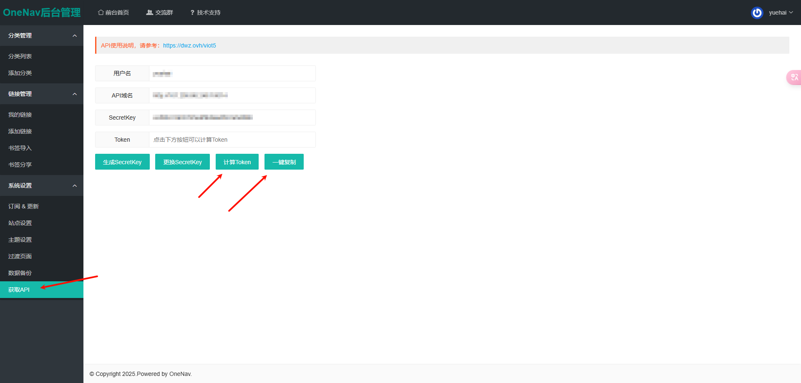

# 一、月海的 oneNav 主题

## 1、说明

1. 基于 Vue3 + Vite 开发的 oneNav 主题
2. 开发原因是便于我自己自定义样式和功能，以及学习 Vue3 和 Vite
3. 需要手动部署，不能像 oneNav 的主题一样直接上传到服务器

## 2、主题

### ①、tushan

1. tushan 主题样式仿照：https://github.com/tsxcw/oneNav
2. 改动：
   1. 分类左侧目录列表，点击可使右侧链接列表滚动到指定位置
   2. 链接图标先获取 oneNav 中配置的，如果没有配置，再自动获取
   3. 链接图标自动获取可能失败，此时建议手动在 oneNav 中配置


### ②、

# 二、配置修改

## 1、服务器配置文件 server_config.json

1. 位置：/public/server_config.json
2. 配置项：
3. `apiBaseUrl`：oneNav 后端接口地址，如：http://89.164.23.214:8080
4. `token`：oneNav 后端接口的 token，用于请求接口时的身份验证



## 2、

# 三、开发命令

1. 安装依赖

```shell
npm install
```

2. 启动项目

```shell
npm run dev
```

3. 打包项目

```shell
npm run build
```

# 四、依赖：

1. 常用依赖
   1. less 是一种动态样式语言，可以方便地为网页增加复杂的样式
   2. vue-router 是 Vue.js 官方的路由管理器，适用于 Vue.js 应用程序的路由
   3. pinia 是一个用于 Vue 3 的状态管理库，它使用 Vue 3 的响应式系统来管理状态
   4. pinia-plugin-persist 是一个用于 pinia 的插件，用于在浏览器中持久化 pinia 的状态，以便在刷新页面后恢复状态；其本质是将状态存储在 localStorage 中
   5. axios 是一个基于 promise 的 HTTP 库，可以用在浏览器和 node.js 中

```shell
npm install less-loader vue-router@4 pinia pinia-plugin-persist axios
```

# 五、nginx 配置

## 1、nginx-proxy-manager 部署

1. 我个人使用的是 docker 部署的 nginx-proxy-manager，所以配置文件是在 webui 中配置的
2. 为防止容器意外停止后数据丢失，首先在宿主机创建目录：
   1. 文件目录：`/home/docker/docker/volumes/nginx-proxy-manager/data`
   2. 原镜像是：`jc21/nginx-proxy-manager`，此处使用的是汉化版
3. 使用 docker 部署：
   1. `-d`：后台运行容器并返回容器 ID，也即启动守护式容器(后台运行)
   2. `-p`：指定端口映射
      1. `81`：nginx-proxy-manager 的 web 访问端口
      2. `80`：http 代理端口，访问代理的 http 地址时，需要加上这个端口
      3. `443`：https 代理端口，访问代理的 https 地址时，需要加上这个端口
   3. `-v`：指定挂载目录
   4. `--restart=unless-stopped`：指定容器的重启策略。除非显式停止，否则总是在宿主机重启或容器退出时重启容器。

```shell
docker run -d \
-p 81:81 \
-p 80:80 \
-p 443:443 \
-v /home/docker/docker/volumes/nginx-proxy-manager/data:/data \
-v /ssl/:/etc/letsencrypt \
--name=nginx-proxy-manager-zh \
chishin/nginx-proxy-manager-zh:latest
```

4. 部署成功后，访问：[http://127.0.0.1:81](http://127.0.0.1:81) 进入管理后台
5. 初始管理员账号：`admin@example.com`
6. 初始管理员密码：`changeme`

## 2、上传编译后的文件

1. 在挂载目录下，即 `/home/docker/docker/volumes/nginx-proxy-manager/data`，创建一个目录：`web`
2. 再在 `web` 目录下创建一个目录：`oneNav-theme-yuehai`
3. 将编译后的文件上传到 `oneNav-theme-yuehai` 目录下


## 3、代理设置

> 本次代理域名是 ip + 路径，因为阿里云没有备案不能被解析为域名

### ①、基础设置

1. 进入 nginx-proxy-manager 的管理后台：[http://127.0.0.1:81](http://127.0.0.1:81)
2. 点击主机 -> 代理服务 -> 添加代理服务


3. 设置一个代理：
   1. 域名：本服务器的 ip
   2. 协议：http；没有域名，无法设置证书，也就没有 https
   3. 转发主机/IP：本服务器的 ip
   4. 转发端口：80，如果不可用，自定义其他的端口也可以
   5. 缓存资源、阻止常见漏洞、支持 WebSockets 不要开启


### ②、添加自定义位置：`/oneNav`

> 该位置用于访问 oneNav 主题的前端页面

1. 点击自定义位置：
   1. 定义位置：`/oneNav`
   2. 协议：http
   3. 转发主机/IP：`127.0.0.1`
   4. 转发端口：`80`
2. 然后点击定义位置后的齿轮按钮，在输入框中输入以下内容：
   1. `location /oneNav {}`：匹配访问路径 `/oneNav` 的请求
   2. `alias /data/web/oneNav-theme-yuehai;`：alias 设定了路径映射，表示 当请求 `/oneNav/xxx` 时，Nginx 实际访问 `/data/web/oneNav-theme-yuehai/xxx`
   3. `index index.html;`：当访问 `/oneNav/` 目录时，默认返回 `index.html`

```nginx
location /oneNav {
    alias /data/web/oneNav-theme-yuehai;
    index index.html;
}
```


### ③、添加自定义位置：`/oneNavApi`

> 该位置用于访问 oneNav 主题的后端接口

1. 点击添加位置，设置第二个自定义位置：
   1. 定义位置：`/oneNavApi`
   2. 协议：http
   3. 转发主机/IP：部署 oneNav 的服务器 ip
   4. 转发端口：部署 oneNav 的服务器端口
2. 然后点击定义位置后的齿轮按钮，在输入框中输入以下内容：
   1. `proxy_pass http://oneNav服务器Ip:oneNav服务器端口/;`：将请求转发到指定的后端服务器，即部署 oneNav 的服务器
   2. `proxy_set_header Host $host;`：设置 Host 请求头为客户端请求时的主机名
   3. `proxy_set_header X-Real-IP $remote_addr;`：设置 X-Real-IP 请求头为客户端的真实 IP
   4. `proxy_set_header X-Forwarded-For $proxy_add_x_forwarded_for;`：设置 X-Forwarded-For 请求头，包含请求经过的所有代理服务器的 IP
   5. `proxy_set_header X-Forwarded-Proto $scheme;`：设置 X-Forwarded-Proto 请求头，表示客户端使用的协议（http 或 https）

```nginx
location /oneNavApi/ {
    proxy_pass http://oneNav服务器Ip:oneNav服务器端口/;
    proxy_set_header Host $host;
    proxy_set_header X-Real-IP $remote_addr;
    proxy_set_header X-Forwarded-For $proxy_add_x_forwarded_for;
    proxy_set_header X-Forwarded-Proto $scheme;
}
```


### ④、~~添加自定义位置：`/faviconkit`~~（废弃）

> 该位置用于访问获取网站图标的 api 接口
> 
> 该位置已经不需要了，因为网站似乎已经关闭了

1. 点击添加位置，设置第三个自定义位置：
   1. 定义位置：`/faviconkit`
   2. 协议：https
   3. 转发主机/IP：`api.faviconkit.com`
   4. 转发端口：`80`
2. 然后点击定义位置后的齿轮按钮，在输入框中输入以下内容：
   1. `proxy_pass https://api.faviconkit.com/;`：将请求转发到指定的后端服务器，即 api.faviconkit.com
   2. `proxy_set_header Host api.faviconkit.com;`：设置 Host 请求头为 api.faviconkit.com，否则 api.faviconkit.com 会返回 403

```nginx
location /faviconkit/ {
    proxy_pass https://api.faviconkit.com/;
    proxy_set_header Host api.faviconkit.com;
    proxy_set_header X-Real-IP $remote_addr;
    proxy_set_header X-Forwarded-For $proxy_add_x_forwarded_for;
    proxy_set_header X-Forwarded-Proto $scheme;
}
```


### ⑤、添加自定义位置：`/linkIcon`

> 1. 该位置用于访问获取网站图标的 api 接口；因为上面的 faviconkit 不能用了，所以自己写了一个
> 2. 对应的 java 后端程序：[yuehai-tool-1.0-SNAPSHOT-jar-with-dependencies.jar](doc/project/yuehai-tool-1.0-SNAPSHOT-jar-with-dependencies.jar)
> 3. 对应的 java 后端接口：http://127.0.0.1:10300/query/website_icon?url=https://www.baidu.com/

1. 点击添加位置，设置第三个自定义位置（参数修改为后端部署的地址）：
   1. 定义位置：`/linkIcon`
   2. 协议：http
   3. 转发主机/IP：`127.0.0.1`
   4. 转发端口：`10300`
2. 然后点击定义位置后的齿轮按钮，在输入框中输入以下内容：
   1. `proxy_pass https://127.0.0.1:10300/;`：将请求转发到指定的后端服务器，即 https://127.0.0.1:10300/

```nginx
location /linkIcon/ {
    proxy_pass https://127.0.0.1:10300/;
    proxy_set_header Host 127.0.0.1;
    proxy_set_header X-Real-IP $remote_addr;
    proxy_set_header X-Forwarded-For $proxy_add_x_forwarded_for;
    proxy_set_header X-Forwarded-Proto $scheme;
    proxy_redirect off;
    # 启用 SNI，并指定正确的 SNI 名称
    proxy_ssl_server_name on;
    proxy_ssl_name 127.0.0.1;
}
```


### ⑥、保存配置

1. 设置完毕后，点击保存即可
2. 最后访问：http://127.0.0.1/oneNav


